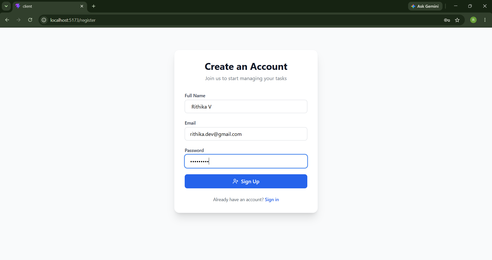
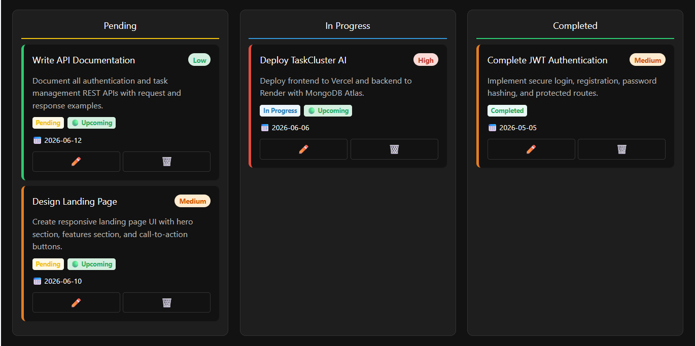
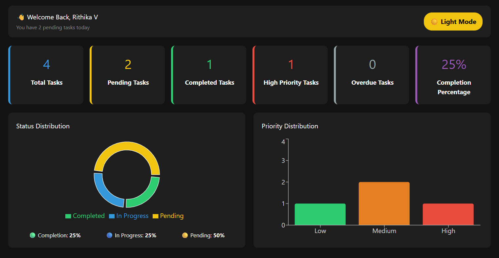
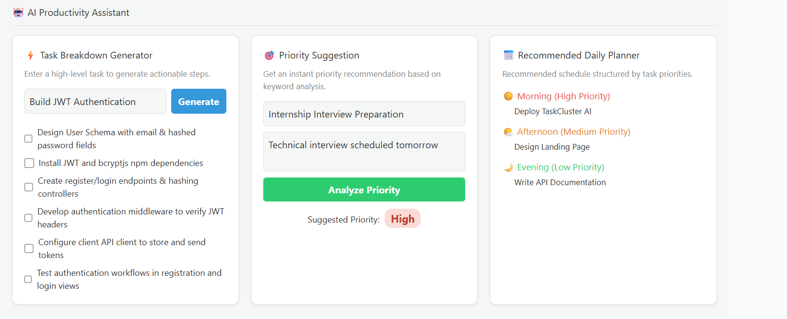
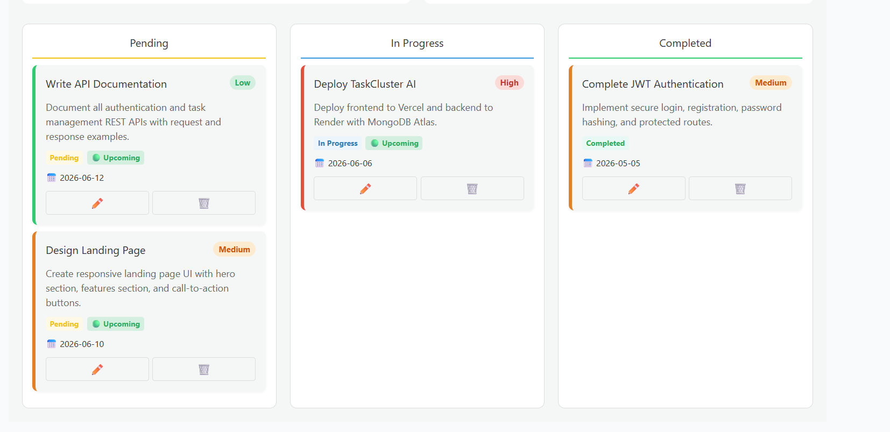
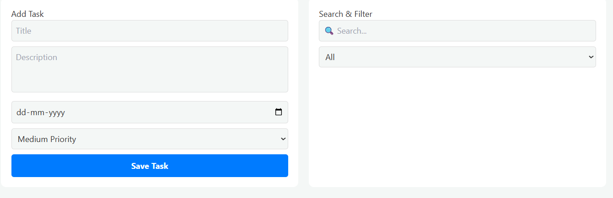

#TaskCluster AI

A modern MERN Stack Task Management Application featuring JWT Authentication, Kanban Workflow Management, Analytics Dashboard, AI Productivity Assistant, Dark Mode, and User-Specific Task Tracking.

---

##Features

###Authentication
- User Registration & Login
- JWT Authentication
- Protected Routes
- Password Hashing using bcryptjs

### Task Management
- Create Tasks
- Update Tasks
- Delete Tasks
- Due Dates
- Priority Levels
- User-Specific Tasks
- Search & Filter Tasks

###  Dashboard Analytics
- Total Tasks
- Pending Tasks
- Completed Tasks
- High Priority Tasks
- Overdue Tasks
- Completion Percentage

###  Visual Analytics
- Status Distribution Pie Chart
- Priority Distribution Bar Chart
- Real-Time Task Statistics

###  Kanban Workflow
- Pending
- In Progress
- Completed

###  AI Productivity Assistant
- Task Breakdown Generator
- Priority Suggestion Engine
- Daily Planner Generator

###  UI Features
- Responsive Design
- Dark Mode / Light Mode
- Toast Notifications
- Modern Dashboard UI

---

##  Tech Stack

### Frontend
- React.js
- Vite
- Tailwind CSS
- Recharts
- React Hot Toast

### Backend
- Node.js
- Express.js
- MongoDB Atlas
- Mongoose
- JWT
- bcryptjs

---

# Screenshots

## Registration Page



---

## Dashboard Analytics



---

## Dark Mode Dashboard



---

## AI Productivity Assistant



---

## Task Management Board



---

## Add Task & Search Filter



---

#  AI Productivity Assistant

### Task Breakdown Generator

Input:

```text
Build JWT Authentication
```

Output:

- Design User Schema
- Install JWT Dependencies
- Create Login & Register APIs
- Configure Middleware
- Store JWT Token
- Test Authentication Flow

---

### Priority Suggestion

Input:

```text
Internship Interview Preparation
```

Output:

```text
High Priority
```

---

### Daily Planner

Automatically schedules:

-  Morning → High Priority Tasks
-  Afternoon → Medium Priority Tasks
-  Evening → Low Priority Tasks

---

#Project Structure

```text
mern-task-manager
│
├── client
│   ├── components
│   ├── context
│   ├── pages
│   ├── services
│   └── assets
│
├── server
│   ├── config
│   ├── controllers
│   ├── middleware
│   ├── models
│   └── routes
│
└── README.md
```

---

#Installation

## Clone Repository

```bash
git clone https://github.com/your-username/taskcluster-ai.git
cd taskcluster-ai
```

## Backend Setup

```bash
cd server
npm install
npm run dev
```

## Frontend Setup

```bash
cd client
npm install
npm run dev
```

---

# Environment Variables

### Server (.env)

```env
PORT=5000

MONGO_URI=your_mongodb_atlas_connection_string

JWT_SECRET=your_jwt_secret
```

### Client (.env)

```env
VITE_API_URL=http://localhost:5000/api
```

---

#Future Enhancements

- AI Chat Assistant
- Team Collaboration
- Activity Logs
- Email Notifications
- Calendar Integration
- Real-Time Updates with Socket.IO

---

#Author

### Rithika V

MERN Stack Developer

---

#License

MIT License
